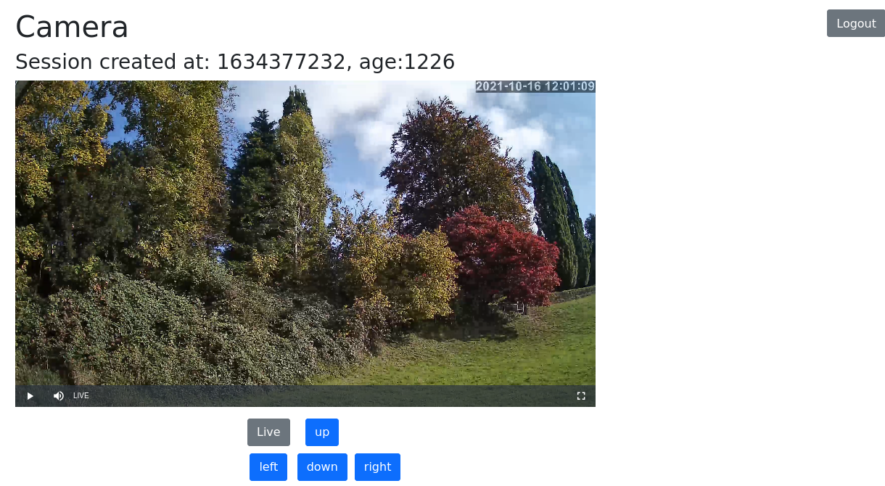

# RTSP to Webcam

This is a project to convert your cheap chinese RTSP "Webcam" via php to a php hosted webcam.
I do not thrust the chinese webcam, so it is blocked (via my router) to access the internet.
RTSP is badly supported by browsers, so it is transcoded via ffmpeg to something most browsers should understand.
This transcoded video stream is then published via a simple PHP website.
The website uses only one user/password so far.

Use this to connect your cheap chinese to the internet without exposing yourself to the bad security risk from the camera.
Keep a watch on your dog/plant/baby/apartment from anywhere on the planet.

I did not find any similar solution on the web, so I invested some time and came up with this solution.

My setup runs on a raspberry pi, connected via static IP to the internet.
The webcam is also connected to https://www.home-assistant.io/ and a webhook moves the camera.

### How to

1. Change the configuration in babycam.sh to your user/pass and IP.
2. Start the script, it should now generate output under /tmp/babycam
3. Install nginx with php support
4. Use the file under nginx/babycam as a template for your own setup, I use letsencrypt for https encryption.
5. Start nginx and navigate to the webpage you configured for nginx
6. Login with your user/pass and click play. You should now see your webcam (I have a delay of about 7 seconds on my stream).

### Issues

* Should use ldash to reduce delay, but so far the standard ffmpeg binary on raspberry pi does not support it.
  7 seconds is good enough for me.
* Needs better documentation, I know.

